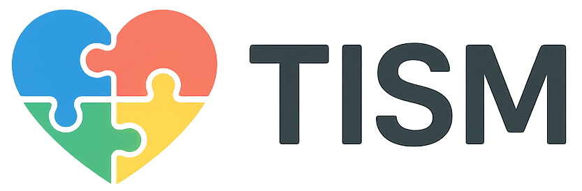

  
  
  ## *Tudo o que você precisa saber sobre o TEA em um clique 💙*
  
  
  
  
  
  
  [![TINA](https://img.shields.io/badge/TINA-00BCD4?style=for-the-badge&logo=data:image/png;base64,iVBORw0KGgoAAAANSUhEUgAAABAAAAAQCAMAAAAoLQ9TAAACH1BMVEUAAAD////////////////////////////////////////////////////////////////////////////////////////////////////////////////////////////////////////////////////////////////////////////////////////////////////////////////////////////////////////////////////////////////////////////////////////////////////////////////////////////////////////////////////////////////////////////////////////////////////////////////////////////////////////////////////////////////////////////////////////////////////////////////////////////////////////////////////////////////////////////////////////////////////////////////////////////////////////////////////////////////////////////////////////////////////////////////////////////////////////////////kmOy0AAAAtXRSTlMAZ6P2/86SV5Mrca3Dg79MiF6anIzIBMpqpsGGSrMWrqhsm5XRdLB9n6xwB6drVrnT/fWWIoC6JUW9DbyBC42l4Vrkooq2jlLCbanLkVWFSROXq1vbgp2gRnnYicVOydfq36/tuOMPX9ZjxufpZItPHXfSDKR68BBv8QO1c3y+JhlNGPnc4LHs5ehhh/pLFCjA/GDd5vLu4s/Q2vPEoSFTj/7VAsfU7970fgpYBp4qHLSZCBWyNyrpLgAAAFZJREFUeJxjYIAAFijNAOXqofIZGBgCUXhuYD2McG08cJ0YGq3RxZGVINgsDAwuLCwsDJosLPPBws1IUhEwdRAaxpNBEoCJabBAAboV0VAeTAahAgkAACEqBCSmYQZ3AAAAAElFTkSuQmCC&logoColor=white)](https://github.com/GabrielFaria1509/ProjetoFetin)

  
  ### 🌍 **Suporte Multilíngue**
  
   **Português** (Nativo)
   **English**
   **Español**
   **Français**
   **Deutsch**
   **Italiano**
   **日本語**
   **한국어**
   **中文**
   **हिन्दी**
   **العربية**
   **Русский**
   **Türkçe**

---

## 🌟 **Sobre o Projeto**

**TISM** é um aplicativo inovador desenvolvido especialmente para a **comunidade TEA** (Transtorno do Espectro Autista). Nosso propósito é criar uma plataforma intuitiva e acessível que fortaleça a comunicação, ofereça suporte contínuo e facilite a interação entre usuários, familiares, cuidadores e profissionais, promovendo **inclusão digital** e **qualidade de vida**.

### 🎯 **Missão**
Empoderar a comunidade TEA através de tecnologia acessível, criando conexões significativas e fornecendo recursos educacionais de qualidade.

---

## 🚀 **Tecnologias & Arquitetura**

### 📱 **Frontend Mobile**
- **Framework:** Flutter (Dart)
- **Plataformas:** iOS & Android
- **Design:** Interface moderna e acessível
- **Performance:** Otimizado para experiência fluida
- **Internacionalização:** Suporte a 13 idiomas (i18n/l10n)
- **Acessibilidade:** Compatível com leitores de tela

### ⚙️ **Backend Robusto**
- **Framework:** Ruby on Rails 7.x
- **Banco de Dados:** PostgreSQL
- **API:** RESTful com endpoints seguros
- **Deploy:** Render (Alta disponibilidade)

---

## ✨ **Funcionalidades Principais**

### 🏠 **Dashboard Intuitivo**
- Central de navegação organizada
- Acesso rápido a todas as funcionalidades
- Interface limpa e responsiva

### 👥 **Sistema de Perfis Avançado**
- **Tipos de Usuário:** Responsáveis, Profissionais, Cuidadores
- **Níveis de Conta:** Normal, Verificado, Bot
- **Personalização:** Edição completa de perfil e configurações

### 💬 **Fórum Interativo Completo**
- **Feed em Tempo Real:** Posts da comunidade com atualizações instantâneas
- **Interações Sociais:** Sistema de likes, comentários e salvamento
- **Busca Inteligente:** Localização avançada de conteúdos
- **Moderação:** Controle de qualidade e segurança

### 📚 **Central de Conhecimento**
- **Artigos Especializados:** Conteúdo educativo sobre TEA
- **Recursos Informativos:** Materiais de apoio profissional
- **Organização:** Categorização por temas e complexidade
- **Multilíngue:** Conteúdo disponível em múltiplos idiomas

### 🤖 **Assistente Virtual Tina**
- **IA Especializada:** Chatbot focado em TEA e neurodiversidade
- **Suporte Multilíngue:** Respostas contextualizadas por idioma
- **Base Científica:** Conhecimento validado por especialistas
- **Moods Expressivos:** Sistema de emoções para melhor comunicação

---

## 🔧 **Recursos Técnicos**

- ✅ **Autenticação Segura** com tokens de sessão
- ✅ **Cache Inteligente** para performance otimizada
- ✅ **Sincronização em Tempo Real** com o servidor
- ✅ **Interface Responsiva** sem travamentos
- ✅ **Arquitetura Modular** e escalável
- ✅ **Proteção de Dados** e privacidade
- ✅ **Internacionalização Completa** (i18n/l10n)
- ✅ **Localização Automática** baseada no dispositivo
- ✅ **Suporte RTL** para idiomas árabes

---

## 🌍 **Impacto Social**

O **TISM** vai além de uma simples aplicação - é uma **ferramenta de empoderamento** para a comunidade TEA. Oferecemos um espaço seguro para:

- 🤝 **Compartilhamento de experiências** e vivências
- 📖 **Acesso a informações confiáveis** sobre TEA
- 🌐 **Construção de redes de apoio** sólidas
- 💙 **Promoção da inclusão** e compreensão mútua

---

  
<strong>Desenvolvido com 💙 para a comunidade TEA</strong>

  
<em>"Tecnologia a serviço da inclusão e do bem-estar"</em>

